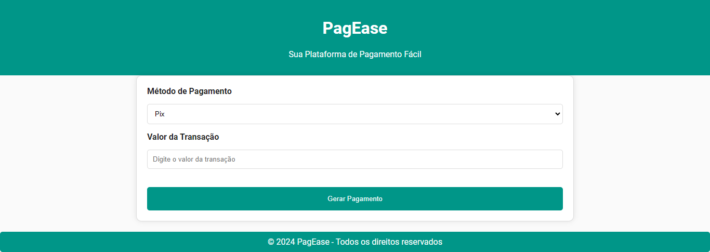
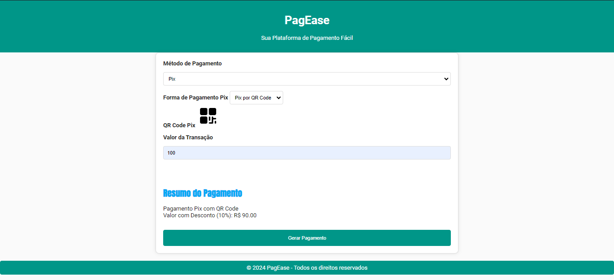
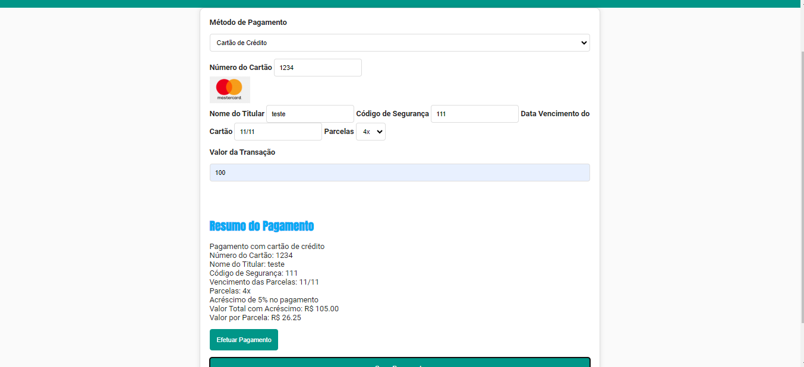
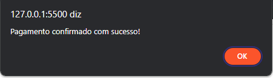

# PagEase - Projeto de Simulação de Pagamento

## Descrição

**PagEase**, um projeto de estudo front-end destinado a explorar conceitos de HTML, CSS e JavaScript. Este projeto simula uma aplicação de pagamento chamada PagEase.

### Funcionalidades Principais

1. **Painel de Pagamento:**
   - Ao clicar em "Informar dados," é verificado se o campo valor está preenchido. Caso contrário, é exibido um alerta ou mensagem informando que o campo deve ser preenchido.
   
2. **Formulário Pix :** 
   - Ao selecionar o método de pagamento Pix, é exibido um painel com informações necessárias para o Pix, mostrando o total com 10% de desconto sobre o valor informado.
   

3. **Formulário de Cartão de Crédito:**
   - Ao digitar no campo Número, a bandeira do cartão é definida pela inicial da numeração (1234 ou 4321), exibindo um ícone correspondente.
   - Se o valor do cartão não iniciar com "1234" nem "4321", é mostrada a mensagem "Número de cartão inválido."
   - O painel calcula automaticamente os valores de parcelamento, aplicando juros de 5% para 4 parcelas e 10% para 5 parcelas. O valor total é atualizado ao selecionar o número de parcelas.
   

4. **Mensagem de Sucesso (`sucesso.html`):**
   - Ao clicar no botão "Pagar," é exibida uma mensagem de sucesso.
     

### Como Contribuir

Contribuições são bem-vindas! Se encontrar bugs, sugerir melhorias ou quiser adicionar novos recursos, sinta-se à vontade para abrir *issues* ou enviar *pull requests*.

### Como Utilizar

1. Clone este repositório:

git clone https://github.com/seu-usuario/pagease.git

## Contato

**Nome:** Patrik Israel  
**E-mail:** patrik-israel@hotmail.com

**Redes Sociais:**

- [LinkedIn](https://www.linkedin.com/in/seu-linkedin/)

Fique à vontade para explorar os projetos, dar feedbacks ou entrar em contato para mais informações. Se encontrar algo interessante ou se precisar de ajuda em algum projeto específico, estou aqui para ajudar.

Obrigado por visitar meu repositório! 🚀
